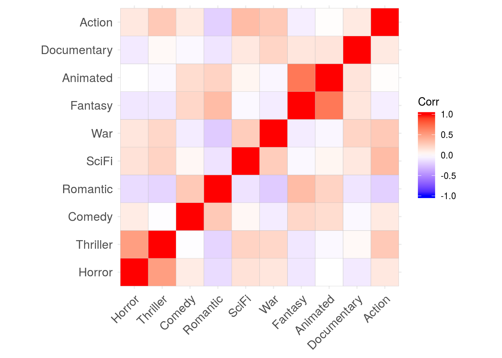
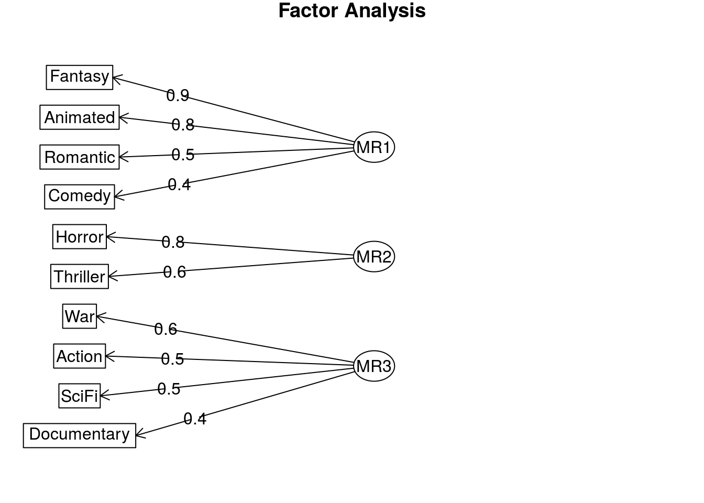
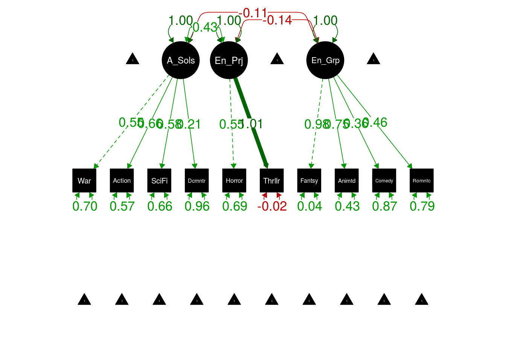

Esta data representa el interés en diferentes tipos gustos sobre películas:

<iframe width="800" height="600" src="https://docs.google.com/spreadsheets/d/e/2PACX-1vQTgH1Y0YksmtL4G9ZPoODRU-au5r1FtuHfm8K27ySxhS-zCS_FuEuMGeco-rD1O5798BDiK5al_hXc/pubhtml?gid=1732121265&amp;single=true&amp;widget=true&amp;headers=false"></iframe>


Los tipos de 


               vars     n       mean          sd   median    trimmed      mad   min   max   range         skew     kurtosis          se
------------  -----  ----  ---------  ----------  -------  ---------  -------  ----  ----  ------  -----------  -----------  ----------
Horror            1   958   2.764092   1.4070597        3   2.705729   1.4826     1     5       4    0.1954091   -1.2507644   0.0454600
Thriller          2   958   3.365344   1.2008920        4   3.430990   1.4826     1     5       4   -0.3419797   -0.8303760   0.0387991
Comedy            3   958   4.500000   0.7808443        5   4.662760   0.0000     1     5       4   -1.6312257    2.4132180   0.0252279
Romantic          4   958   3.484342   1.2117783        4   3.559896   1.4826     1     5       4   -0.3312922   -0.8692307   0.0391508
SciFi             5   958   3.094990   1.3132060        3   3.118490   1.4826     1     5       4   -0.0424614   -1.1142428   0.0424278
War               6   958   3.132568   1.3453600        3   3.165365   1.4826     1     5       4   -0.0566352   -1.1557596   0.0434666
Fantasy           7   958   3.744259   1.1861018        4   3.858073   1.4826     1     5       4   -0.5480089   -0.7192661   0.0383212
Animated          8   958   3.771399   1.2321606        4   3.906250   1.4826     1     5       4   -0.6579499   -0.6674859   0.0398093
Documentary       9   958   3.633612   1.1348004        4   3.721354   1.4826     1     5       4   -0.4794855   -0.5959519   0.0366637
Action           10   958   3.514614   1.2340076        4   3.602865   1.4826     1     5       4   -0.4085078   -0.8815674   0.0398690


1. Calculemos matriz de correlación:


```r
theData=movie[,-c(1,12)] # sin los Scores ni nombre de país.

# esta es:
library(polycor)
corMatrix=polycor::hetcor(theData)$correlations
```


2. Explorar correlaciones:

* Sin evaluar significancia:

```r
library(ggcorrplot)

ggcorrplot(corMatrix)
```



Si puedes ver bloques correlacionados, hay esperanza de un buen analisis factorial.


3. Verificar si datos permiten factorizar:


```r
library(psych)
psych::KMO(corMatrix) 
```

```
## Kaiser-Meyer-Olkin factor adequacy
## Call: psych::KMO(r = corMatrix)
## Overall MSA =  0.62
## MSA for each item = 
##      Horror    Thriller      Comedy    Romantic       SciFi         War 
##        0.55        0.63        0.58        0.71        0.74        0.75 
##     Fantasy    Animated Documentary      Action 
##        0.58        0.57        0.61        0.66
```

4. Verificar si la matriz de correlaciones es adecuada

Aqui hay dos pruebas:

* Hnula: La matriz de correlacion es una [matriz identidad](https://en.wikipedia.org/wiki/Identity_matrix)


```r
cortest.bartlett(corMatrix,n=nrow(theData))$p.value>0.05
```

```
## [1] FALSE
```

* Hnula: La matriz de correlacion es una [matriz singular](http://mathworld.wolfram.com/SingularMatrix.html).


```r
library(matrixcalc)

is.singular.matrix(corMatrix)
```

```
## [1] FALSE
```

5. Determinar en cuantos factores o variables latentes podríamos redimensionar la data:


```r
fa.parallel(corMatrix,fm = 'ML', fa = 'fa')
```


```
## Parallel analysis suggests that the number of factors =  3  and the number of components =  NA
```

Se sugieren 3, veamos:


6. Redimensionar a numero menor de factores

* Resultado inicial:


```r
library(GPArotation)
movieF_result <- fa(theData,nfactors = 3,cor = 'mixed',rotate = "varimax",fm="minres")
```

```
## 
## mixed.cor is deprecated, please use mixedCor.
```

```r
print(movieF_result$loadings)
```

```
## 
## Loadings:
##             MR1    MR2    MR3   
## Horror              0.804       
## Thriller            0.638  0.285
## Comedy       0.404  0.168       
## Romantic     0.474 -0.112 -0.349
## SciFi               0.212  0.486
## War         -0.127  0.110  0.567
## Fantasy      0.887 -0.166       
## Animated     0.777         0.140
## Documentary        -0.157  0.418
## Action              0.244  0.525
## 
##                  MR1   MR2   MR3
## SS loadings    1.810 1.267 1.238
## Proportion Var 0.181 0.127 0.124
## Cumulative Var 0.181 0.308 0.432
```

* Resultado mejorado:


```r
print(movieF_result$loadings,cutoff = 0.4)
```

```
## 
## Loadings:
##             MR1    MR2    MR3   
## Horror              0.804       
## Thriller            0.638       
## Comedy       0.404              
## Romantic     0.474              
## SciFi                      0.486
## War                        0.567
## Fantasy      0.887              
## Animated     0.777              
## Documentary                0.418
## Action                     0.525
## 
##                  MR1   MR2   MR3
## SS loadings    1.810 1.267 1.238
## Proportion Var 0.181 0.127 0.124
## Cumulative Var 0.181 0.308 0.432
```

Cuando logramos que cada variable se vaya a un factor, tenemos una _estructura simple_.

* Resultado visual:


```r
fa.diagram(movieF_result)
```




```r
# mientras mas grande mejor (lo que aporta)
sort(movieF_result$communalities)
```

```
##      Comedy Documentary       SciFi      Action         War    Romantic 
##   0.1948658   0.2091844   0.2814678   0.3356979   0.3493307   0.3592269 
##    Thriller    Animated      Horror     Fantasy 
##   0.4917699   0.6276559   0.6492062   0.8166243
```

```r
# mientras mas grande peor (lo que mantiene)
sort(movieF_result$uniquenesses)
```

```
##     Fantasy      Horror    Animated    Thriller    Romantic         War 
##   0.1833786   0.3507944   0.3723413   0.5082288   0.6407700   0.6506693 
##      Action       SciFi Documentary      Comedy 
##   0.6643005   0.7185299   0.7908096   0.8051332
```


```r
sort(movieF_result$complexity)
```

```
##      Horror     Fantasy    Animated         War       SciFi      Comedy 
##    1.008313    1.075593    1.077357    1.178237    1.372137    1.377738 
##    Thriller Documentary      Action    Romantic 
##    1.400263    1.403369    1.418972    1.967837
```


```r
library(lavaan)
```


```r
modelCFA <- '
  # measurement model
    A_Solas =~ War + Action + SciFi + Documentary
    En_Pareja =~ Horror + Thriller
    En_Grupo =~ Fantasy + Animated + Comedy + Romantic
'
```


```r
ORDINALES=c("Horror","Thriller","Comedy","Romantic",   "SciFi","War","Fantasy","Animated","Documentary","Action")
```


```r
cfaFIT=cfa(modelCFA, 
           data=theData,
           ordered = ORDINALES)
```


```r
library(semPlot)
```

```
## Registered S3 methods overwritten by 'huge':
##   method    from   
##   plot.sim  BDgraph
##   print.sim BDgraph
```

```r
semPaths(cfaFIT, what='std', nCharNodes=6, sizeMan=5,
         edge.label.cex=1.25, curvePivot = TRUE, fade=FALSE,color='black')
```




