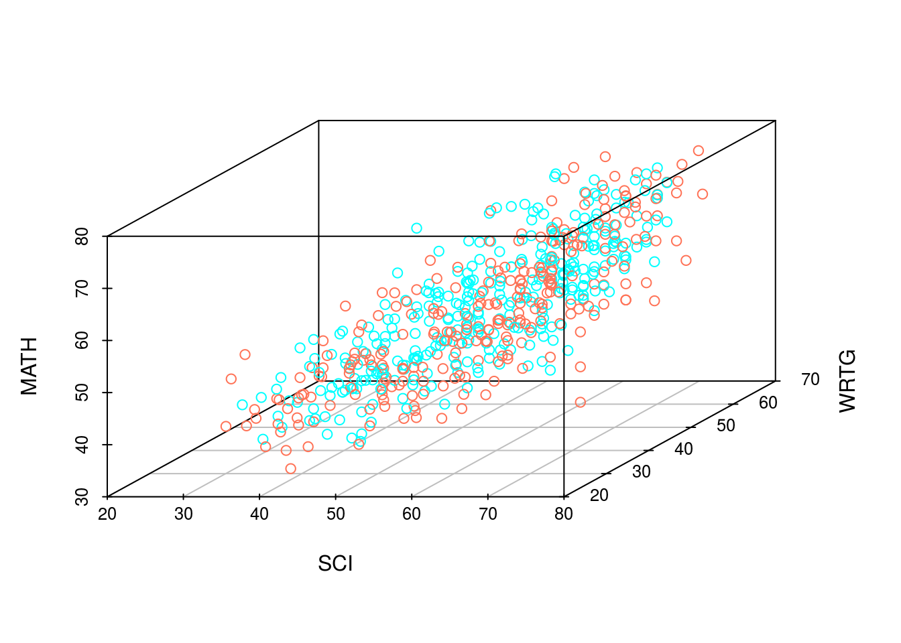

 <header><h1>PSICOLOGIA: Investigación y Estadística II</h1>  </header>

* Profesor:  <a href="http://www.pucp.edu.pe/profesor/jose-manuel-magallanes/" target="_blank">Dr. José Manuel Magallanes, Ph.D.</a>  
    - Profesor del Departamento de Ciencias Sociales, Sección de Ciencia Política y Gobierno. Profesor Afiliado del Departamento de Psicología.
    - [Oficina 105](https://goo.gl/maps/xuGeG6o9di1i1y5m6) - Edificio CISEPA / ECONOMIA / CCSS
    - Telefono: (51) 1 - 6262000 anexo 4302
    - Correo Electrónico: [jmagallanes@pucp.edu.pe](mailto:jmagallanes@pucp.edu.pe)
    

____

 <header><h2>De la Correlación a la Regresión</h2>  </header>

____

En esta sesión deseo que entiendas por qué es necesario ir más allá de la correlación (_Pearson_, _Spearman_, etc.) o las diferencias de valores medios (_t test_, _kruska wallis_, etc.) .

Trabajemos con nuestros datos del archivo en SPSS **hsb.sav**:

1. Asumamos que nuestra variable de interés es el desempeño en matemáticas; así, nuestra _variable dependiente_ está  representada por la variable _MATH_. 

2. Consideremos que nos interesa saber la posible relación que pueda tener la variable que ha medido el desempeño en escritura; así una variable independiente sería la representada por la variable _WRTG_.  Hasta ahora sabemos que como son _dos_ variables de tipo _numérico_ debemos usar una correlación. La gráfica de correlación es esta:

Vemos que hay una aparente relación. Asumiendo un camino paramétrico, podemos pedir el coeficiente de Pearson, el cuál al ser calculado obtenemos 0.6326664 (con p-value= 0). Si hubieramos seguido una ruta no paramétrica, informaríamos el coeficiente de Spearman:0.6415126 (con p-value= 0).

3. Consideremos que nos interesa además saber _a la vez_ la posible relación que pueda tener la variable que ha medido el desempeño en ciencias; así otra variable independiente sería la representada por la variable _SCI_.  Como es otra variable _numérica_ no podemos calcular la correlación de tres variables, pero podemos tratar de verlo visualmente:

* En tres dimensiones:

* En dos dimensiones:

Podríamos calcular la correlación de SCI con MATH, obteniendo el Pearson (0.6495261, p-value= 0) y el Spearman (0.6551515,p-value= 0).  

Visualmente vemos relación, pero **no tenemos** un coeficiente para medir ello.

4. Y si quisiéramos ver si el sexo tiene algun rol en todo esto? Como ésta es una variable _categórica_ y _dicotómica_, lo primero que puede venir a la mente es esta gráfica:

Los boxplots tienen un _notch_ flanqueando a la mediana, para sugerir igualdad de medianas si éstos se intersectan; de ahi que parece no haber diferencia sustantiva entre hombres y mujeres en cuanto a su desempeño en MATH. 

Este gráfico complementa lo anterior:

Nota que los histogramas de la data _real_ tienen encima la curva _normal_ que _idealmente_ tendría esa data. La lejanía entre ellos, sugeriría no normalidad. Como ello no es fácil de discernir visualmente, tenemos por costumbre calcular algun coeficiente, como el _Shapiro-Wilk_:

<table class="table table-striped table-hover" style="width: auto !important; ">
 <thead>
  <tr>
   <th style="text-align:left;"> SEX </th>
   <th style="text-align:right;"> W </th>
   <th style="text-align:right;"> Prob </th>
  </tr>
 </thead>
<tbody>
  <tr>
   <td style="text-align:left;"> Male </td>
   <td style="text-align:right;"> 0.9837903 </td>
   <td style="text-align:right;"> 0.0034565 </td>
  </tr>
  <tr>
   <td style="text-align:left;"> Female </td>
   <td style="text-align:right;"> 0.9790040 </td>
   <td style="text-align:right;"> 0.0001031 </td>
  </tr>
</tbody>
</table>

Esto nos sugiere un camino no paramétrico para ver la diferencia de valores medios. La prueba no paramétrica no rechazaría la igualdad de valores medios (Mann-Whitney con p valor = 0.3085543).

* Veamos como representar al sexo en nuestra gráfica entre WRTG y MATH:

* Veamos como representar al sexo en nuestra gráfica entre WRTG, SCI y MATH:

Otra alternativa puede ser:

Y claro:

En todos los gráficos vemos que los hombres y las mujeres están distribuidos por todo el gráfico, lo cual nos sugiere que no hay diferencias aun en dimensiones mayores a dos. Sin embargo, no tenemos una medida de cuanto cada uno afecta a nuestra dependiente.

De ahi que necesitamos la **regresión**.

## REGRESIÓN

La regresión sí quiere informar cuánto una variable (_independiente_) puede explicar la variación de otra (_dependiente_), de ahí que es una técnica para probar hipótesis direccionales o asimétricas (las correlaciones tiene hipótesis simétricas).

La regresión busca proponer un modelo, es decir una ecuación, que recoja como una variable explicaría a otra. Por ejemplo, para la hipótesis '_el nivel de desempeño en escritura afecta el desempeño en matemáticas_', la regresión arrojaría este resultado:

  

<table style="text-align:center"><tr><td colspan="2" style="border-bottom: 1px solid black"></td></tr><tr><td style="text-align:left"></td><td><em>Dependent variable:</em></td></tr>
<tr><td></td><td colspan="1" style="border-bottom: 1px solid black"></td></tr>
<tr><td style="text-align:left"></td><td>MATH</td></tr>
<tr><td colspan="2" style="border-bottom: 1px solid black"></td></tr><tr><td style="text-align:left">Constant</td><td>19.769***</td></tr>
<tr><td style="text-align:left"></td><td>(1.633)</td></tr>
<tr><td style="text-align:left"></td><td></td></tr>
<tr><td style="text-align:left">WRTG</td><td>0.612***</td></tr>
<tr><td style="text-align:left"></td><td>(0.031)</td></tr>
<tr><td style="text-align:left"></td><td></td></tr>
<tr><td colspan="2" style="border-bottom: 1px solid black"></td></tr><tr><td style="text-align:left">Observations</td><td>600</td></tr>
<tr><td style="text-align:left">R2</td><td>0.400</td></tr>
<tr><td style="text-align:left">Adjusted R2</td><td>0.399</td></tr>
<tr><td style="text-align:left">Residual Std. Error</td><td>7.297 (df = 598)</td></tr>
<tr><td style="text-align:left">F Statistic</td><td>399.110*** (df = 1; 598)</td></tr>
<tr><td colspan="2" style="border-bottom: 1px solid black"></td></tr><tr><td style="text-align:left"><em>Note:</em></td><td style="text-align:right">*p<0.1; **p<0.05; ***p<0.01</td></tr>
</table>

  

Aquí ya sabemos algo interesante, **primero** que WRTG tiene efecto, pues es _significativo_ (indicado por los dos asteriscos); **segundo**, que ese efecto es _directo_, pues el coeficiente calculado es positivo; y **tercero** que la _magnitud_ de ese efecto es 0.612, lo que indica cuanto aumenta MATH en promedio cuando WRTG se incremente en una unidad.

Esto es información suficiente para representar esa relación con una ecuación. Como la ecuación sólo tiene una variable independiente podemos producir una recta sobre el gráfico de correlación:

Esa recta podemos representarla así:

$$  Y= 19.7690323 + 0.6123904 \cdot WRTG + \epsilon$$

El Y verdadero es MATH, pero la regresión produce un $\hat{Y}$ estimado. Justamente el _R cuadrado ajustado_ (0.4002668) nos brinda un porcentaje (multiplicalo por 100) que nos da una pista de nuestra la cercanía a una situación perfecto (cuando vale **1**).

Y sí queremos ver el efecto de SCI?

<table style="text-align:center"><tr><td colspan="2" style="border-bottom: 1px solid black"></td></tr><tr><td style="text-align:left"></td><td><em>Dependent variable:</em></td></tr>
<tr><td></td><td colspan="1" style="border-bottom: 1px solid black"></td></tr>
<tr><td style="text-align:left"></td><td>MATH</td></tr>
<tr><td colspan="2" style="border-bottom: 1px solid black"></td></tr><tr><td style="text-align:left">Constant</td><td>10.629***</td></tr>
<tr><td style="text-align:left"></td><td>(1.630)</td></tr>
<tr><td style="text-align:left"></td><td></td></tr>
<tr><td style="text-align:left">WRTG</td><td>0.377***</td></tr>
<tr><td style="text-align:left"></td><td>(0.033)</td></tr>
<tr><td style="text-align:left"></td><td></td></tr>
<tr><td style="text-align:left">SCI</td><td>0.415***</td></tr>
<tr><td style="text-align:left"></td><td>(0.033)</td></tr>
<tr><td style="text-align:left"></td><td></td></tr>
<tr><td colspan="2" style="border-bottom: 1px solid black"></td></tr><tr><td style="text-align:left">Observations</td><td>600</td></tr>
<tr><td style="text-align:left">R2</td><td>0.524</td></tr>
<tr><td style="text-align:left">Adjusted R2</td><td>0.523</td></tr>
<tr><td style="text-align:left">Residual Std. Error</td><td>6.505 (df = 597)</td></tr>
<tr><td style="text-align:left">F Statistic</td><td>328.846*** (df = 2; 597)</td></tr>
<tr><td colspan="2" style="border-bottom: 1px solid black"></td></tr><tr><td style="text-align:left"><em>Note:</em></td><td style="text-align:right">*p<0.1; **p<0.05; ***p<0.01</td></tr>
</table>

En este caso, la regresión tendrá una formula con dos variables explicando la dependiente, así que en vez de producir una línea buscará producir un plano:

Este plano podemos representarlo así:

$$  Y= 10.6285904 + 0.3765304 \cdot WRTG + 0.4152733 \cdot SCI + \epsilon$$

Nuevamente, el Y verdadero es MATH, pero la regresión produce un $\hat{Y}$ estimado en forma de plano. De igual manera el _R cuadrado ajustado_ (0.5241861) nos da una pista de nuestra lejanía a una situación perfecto.

Es clave darse cuenta de otro detalle, que el coeficiente de WRTG ha variado en la fórmula ahora que está presente SCI ¿Por qué sucede esto? Veamoslo así: en el primer caso, WRTG y $\epsilon$ buscaban representar la variabilidad en MATH, y ahora, en el segundo caso, viene SCI para mejorar esa explicación; es así que el peso de la explicación ahora se recalcula y el coeficiente de WRTG deja de explicar lo que le corresponde a SCI, y \epsilon también le entrega _algo_ a SCI. 

Como \epsilon no tiene coeficiente, representamos su variación usando el error típico de los residuos o _residual standard error_ (RSE). Nótese que éste ha variado de un modelo ha otro, ahora tenemos un RSE menor. Aquí vale la pena preguntarse si esta disminución del error es significativa, obteniendo:

  

<table style="text-align:center"><caption><strong>Table de Análisis de Varianza</strong></caption>
<tr><td colspan="7" style="border-bottom: 1px solid black"></td></tr><tr><td style="text-align:left"></td><td>Res.Df</td><td>RSS</td><td>Df</td><td>Sum of Sq</td><td>F</td><td>Pr(> F)</td></tr>
<tr><td colspan="7" style="border-bottom: 1px solid black"></td></tr><tr><td style="text-align:left">1</td><td>598</td><td>31,842.070</td><td></td><td></td><td></td><td></td></tr>
<tr><td style="text-align:left">2</td><td>597</td><td>25,262.730</td><td>1</td><td>6,579.335</td><td>155.481</td><td>0</td></tr>
<tr><td colspan="7" style="border-bottom: 1px solid black"></td></tr></table>

  

La comparación de modelos usando la tabla de análisis de varianza  (anova) propone como hipótesis nula que los modelos no difieren (no se ha reducido el error al pasar de un modelo a otro). Como la comparación es _significativa_ (vea el **P**), rechazamos igualdad de modelos: el modelo 2 sí reduce el error al incluir una variable más.

Finalmente, veamos el rol de sexo:

<table style="text-align:center"><tr><td colspan="2" style="border-bottom: 1px solid black"></td></tr><tr><td style="text-align:left"></td><td><em>Dependent variable:</em></td></tr>
<tr><td></td><td colspan="1" style="border-bottom: 1px solid black"></td></tr>
<tr><td style="text-align:left"></td><td>MATH</td></tr>
<tr><td colspan="2" style="border-bottom: 1px solid black"></td></tr><tr><td style="text-align:left">Constant</td><td>11.306***</td></tr>
<tr><td style="text-align:left"></td><td>(1.630)</td></tr>
<tr><td style="text-align:left"></td><td></td></tr>
<tr><td style="text-align:left">WRTG</td><td>0.424***</td></tr>
<tr><td style="text-align:left"></td><td>(0.036)</td></tr>
<tr><td style="text-align:left"></td><td></td></tr>
<tr><td style="text-align:left">SCI</td><td>0.375***</td></tr>
<tr><td style="text-align:left"></td><td>(0.035)</td></tr>
<tr><td style="text-align:left"></td><td></td></tr>
<tr><td style="text-align:left">SEXFemale</td><td>-1.922***</td></tr>
<tr><td style="text-align:left"></td><td>(0.582)</td></tr>
<tr><td style="text-align:left"></td><td></td></tr>
<tr><td colspan="2" style="border-bottom: 1px solid black"></td></tr><tr><td style="text-align:left">Observations</td><td>600</td></tr>
<tr><td style="text-align:left">R2</td><td>0.533</td></tr>
<tr><td style="text-align:left">Adjusted R2</td><td>0.530</td></tr>
<tr><td style="text-align:left">Residual Std. Error</td><td>6.452 (df = 596)</td></tr>
<tr><td style="text-align:left">F Statistic</td><td>226.510*** (df = 3; 596)</td></tr>
<tr><td colspan="2" style="border-bottom: 1px solid black"></td></tr><tr><td style="text-align:left"><em>Note:</em></td><td style="text-align:right">*p<0.1; **p<0.05; ***p<0.01</td></tr>
</table>

Aunque no podemos graficar cuatro coordenadas, podemos usar elementos visuales:

Nuestra nueva ecuación sería:

$$  Y= 11.306349 + 0.4235786 \cdot WRTG + 0.3748025 \cdot SCI + -1.9219692 \cdot SEX + \epsilon$$

Nuevamente podemos ver si añadir SEXO en este modelo representa una mejora al anterior:

<table style="text-align:center"><caption><strong>Table de Análisis de Varianza</strong></caption>
<tr><td colspan="7" style="border-bottom: 1px solid black"></td></tr><tr><td style="text-align:left"></td><td>Res.Df</td><td>RSS</td><td>Df</td><td>Sum of Sq</td><td>F</td><td>Pr(> F)</td></tr>
<tr><td colspan="7" style="border-bottom: 1px solid black"></td></tr><tr><td style="text-align:left">1</td><td>598</td><td>31,842.070</td><td></td><td></td><td></td><td></td></tr>
<tr><td style="text-align:left">2</td><td>597</td><td>25,262.730</td><td>1</td><td>6,579.335</td><td>158.063</td><td>0</td></tr>
<tr><td style="text-align:left">3</td><td>596</td><td>24,808.420</td><td>1</td><td>454.308</td><td>10.914</td><td>0.001</td></tr>
<tr><td colspan="7" style="border-bottom: 1px solid black"></td></tr></table>

  
  
Finalmente, podemos resumir todo en esta tabla:

  

<table style="text-align:center"><caption><strong>Modelos planteadas</strong></caption>
<tr><td colspan="4" style="border-bottom: 1px solid black"></td></tr><tr><td style="text-align:left"></td><td colspan="3">Variable dependiente:</td></tr>
<tr><td></td><td colspan="3" style="border-bottom: 1px solid black"></td></tr>
<tr><td style="text-align:left"></td><td colspan="3">Desempeño en Matemáticas</td></tr>
<tr><td style="text-align:left"></td><td>(1)</td><td>(2)</td><td>(3)</td></tr>
<tr><td colspan="4" style="border-bottom: 1px solid black"></td></tr><tr><td style="text-align:left">Constante</td><td>19.77***</td><td>10.63***</td><td>11.31***</td></tr>
<tr><td style="text-align:left"></td><td>(1.63)</td><td>(1.63)</td><td>(1.63)</td></tr>
<tr><td style="text-align:left"></td><td></td><td></td><td></td></tr>
<tr><td style="text-align:left">Desempeño en Escritura</td><td>0.61***</td><td>0.38***</td><td>0.42***</td></tr>
<tr><td style="text-align:left"></td><td>(0.03)</td><td>(0.03)</td><td>(0.04)</td></tr>
<tr><td style="text-align:left"></td><td></td><td></td><td></td></tr>
<tr><td style="text-align:left">Desempeño en Ciencias</td><td></td><td>0.42***</td><td>0.37***</td></tr>
<tr><td style="text-align:left"></td><td></td><td>(0.03)</td><td>(0.04)</td></tr>
<tr><td style="text-align:left"></td><td></td><td></td><td></td></tr>
<tr><td style="text-align:left">SEXO (mujer)</td><td></td><td></td><td>-1.92***</td></tr>
<tr><td style="text-align:left"></td><td></td><td></td><td>(0.58)</td></tr>
<tr><td style="text-align:left"></td><td></td><td></td><td></td></tr>
<tr><td colspan="4" style="border-bottom: 1px solid black"></td></tr><tr><td style="text-align:left">Observations</td><td>600</td><td>600</td><td>600</td></tr>
<tr><td style="text-align:left">Adjusted R2</td><td>0.40</td><td>0.52</td><td>0.53</td></tr>
<tr><td style="text-align:left">Residual Std. Error</td><td>7.30</td><td>6.51</td><td>6.45</td></tr>
<tr><td colspan="4" style="border-bottom: 1px solid black"></td></tr><tr><td style="text-align:left">Notas:</td><td colspan="3" style="text-align:right">*p<0.1; **p<0.05; ***p<0.01</td></tr>
</table>

  

