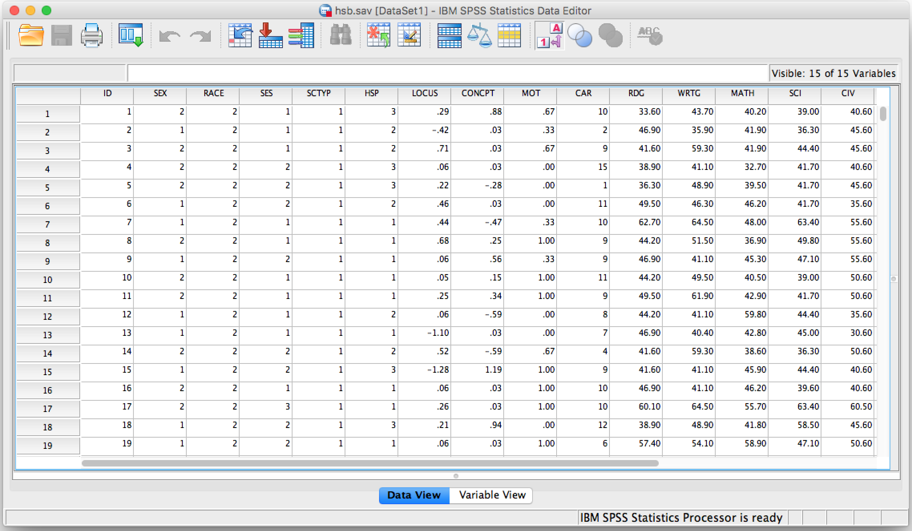
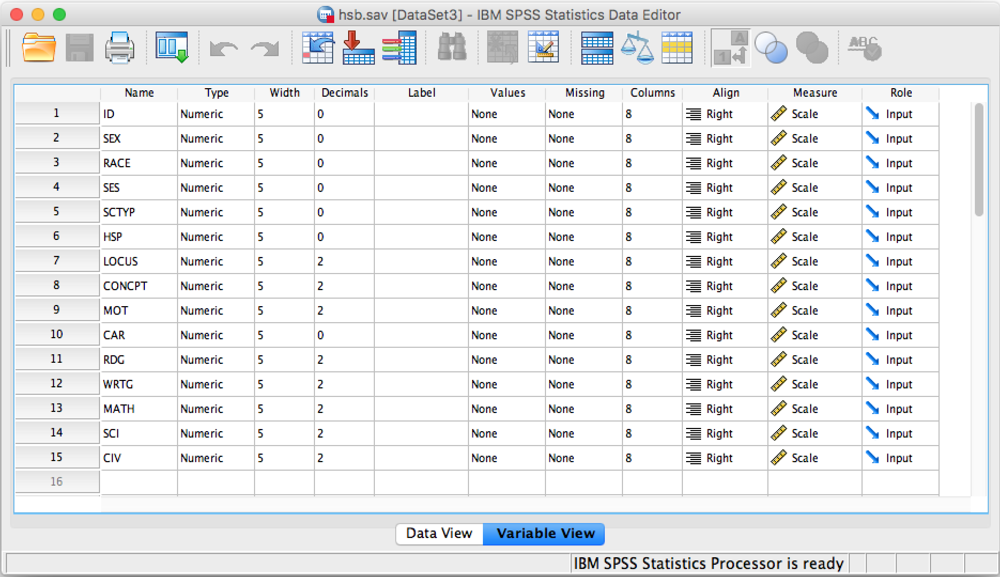
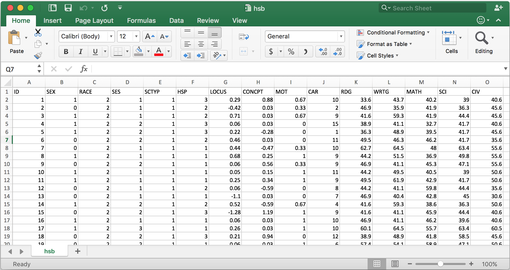
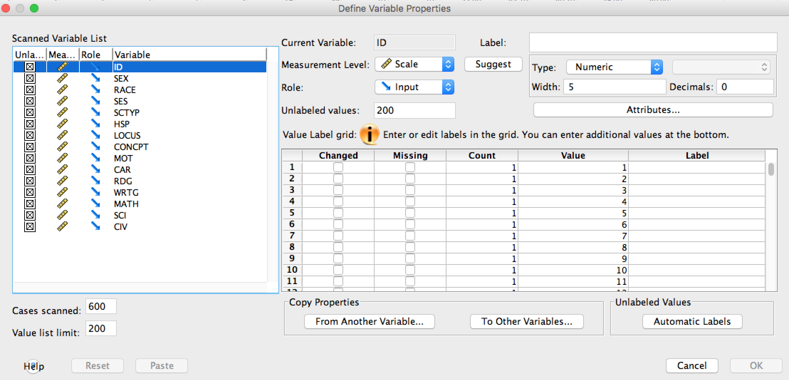
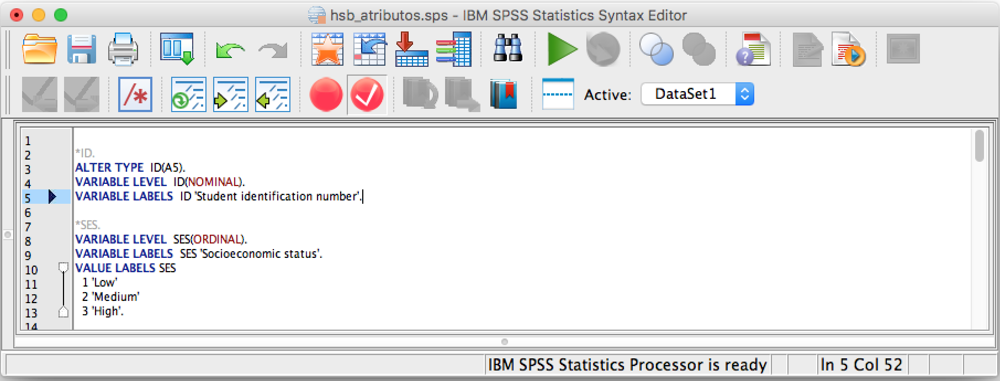
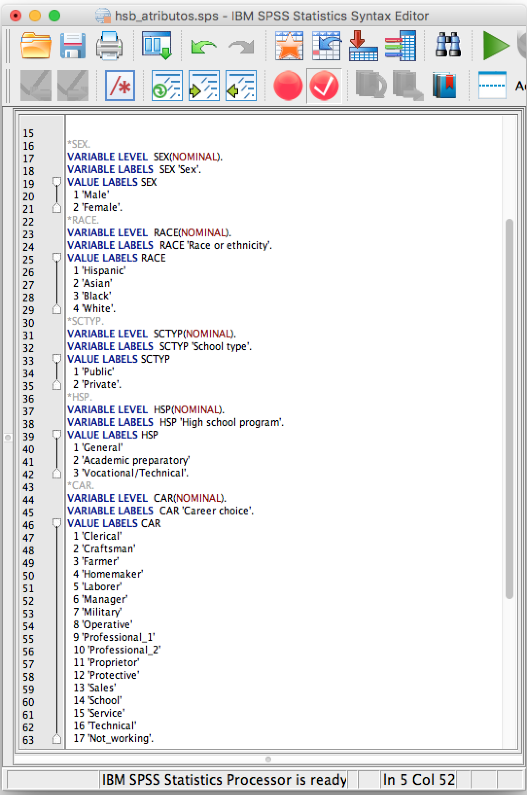
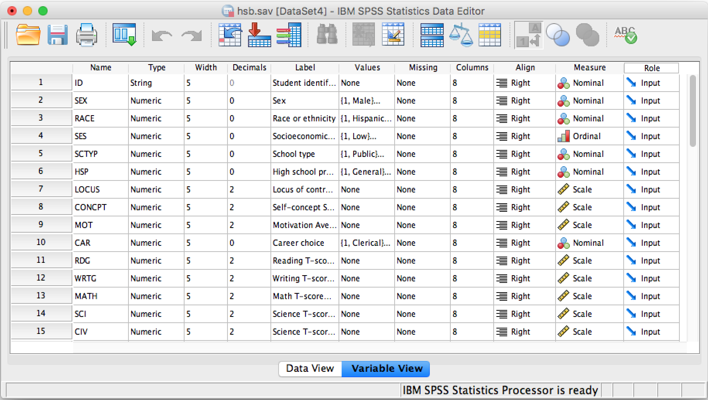
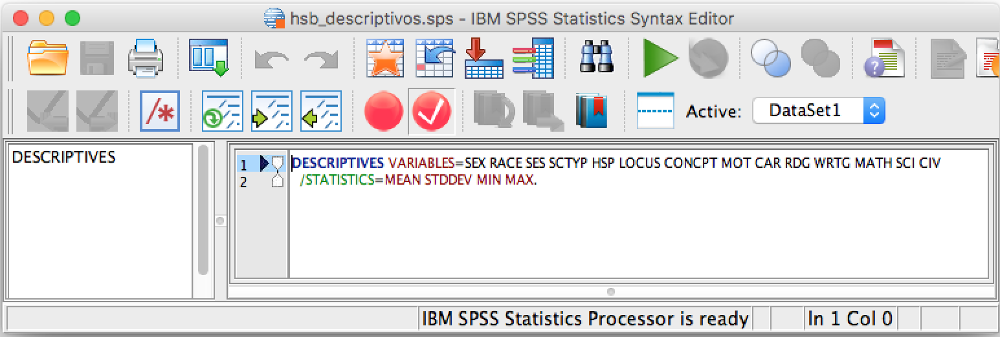
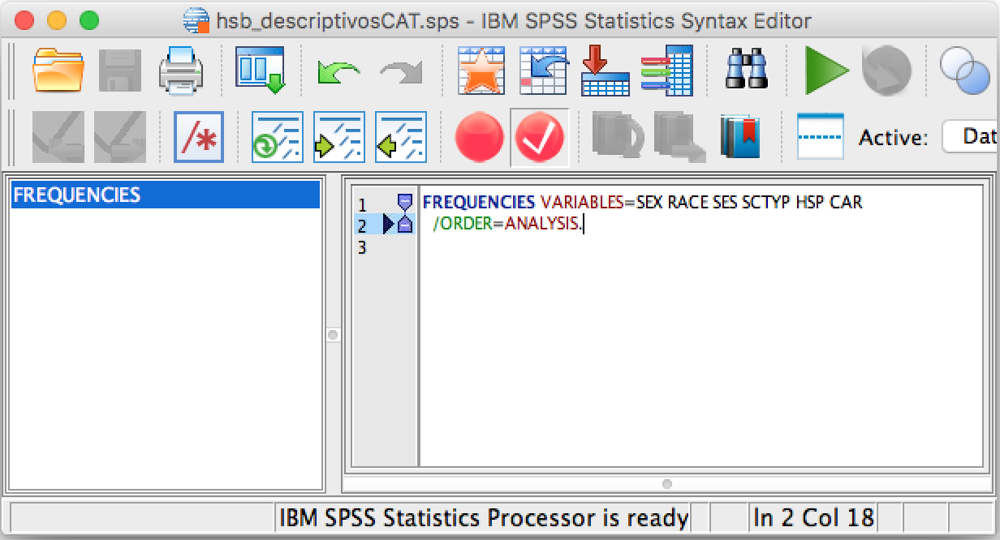
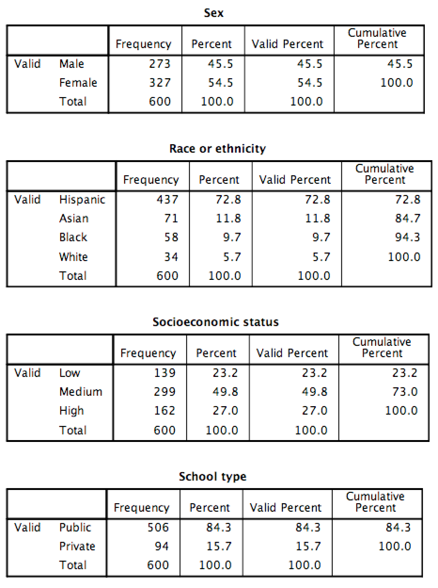

<center></center>

<center> <header><h1>PSICOLOGIA: Investigación y Estadística II</h1>  </header></center>

* Profesor:  <a href="http://www.pucp.edu.pe/profesor/jose-manuel-magallanes/" target="_blank">Dr. José Manuel Magallanes, Ph.D.</a> <br>
    - Profesor del Departamento de Ciencias Sociales, Sección de Ciencia Política y Gobierno. Profesor Afiliado del Departamento de Psicología.
    - [Oficina 105](https://goo.gl/maps/xuGeG6o9di1i1y5m6) - Edificio CISEPA / ECONOMIA / CCSS
    - Telefono: (51) 1 - 6262000 anexo 4302
    - Correo Electrónico: [jmagallanes@pucp.edu.pe](mailto:jmagallanes@pucp.edu.pe)
    

____

<center> <header><h2>Cambiando atributos de las variables</h2>  </header></center>
____

### 1. Carga de archivos

Los archivos deben estar siempre en la nube, si es en SPSS se puede usar GitHub para almacenarlos, si es en CSV, en GoogleSheets. En particular, usaras SPSS si alguien comparte ese tipo de archivo contigo; pero si recoges tu propia información, será mejor que te familiarices con CSV en Google.

El archivo **hsb.sav** puedes descargarlo desde [aqui](https://github.com/PsicologiaPUCP/ArchivosDeDatos/raw/master/hsb.sav), y si lo abres en SPSS verás, en la vista de datos (Data View) esto:



Lo que ves es los datos en SPSS pero **no sabes si los tipos de datos** han sido bien identificados. La buena identificación de los tipos de datos es clave para saber bien qué técnicas elegir. En este momento, SPSS ha identificado los datos así el vista de variables (metadata):




SPSS puede manejar esta información pues tiene la vista de datos y la vista de metadata. Por ejemplo, Excel no tiene metadata:



Si subes tu archivo en Excel a GoogleSheets y lo conviertes a formato CSV, puedes publicarlo siguiendo estas [instrucciones](https://www.youtube.com/watch?time_continue=159&v=jxKmnhbrUWs). El link en formato CSV puedes leerlo en R y de ahí darle tratamiento para llevarlo a SPSS:


```{r}
# link a data:
linkCSV="https://docs.google.com/spreadsheets/d/e/2PACX-1vTcFY_f_k94wuMUL8ISrklSmjlbYgnPeEVdGApFI0Y39OQB8IrHvv1bmD6E0u9uYo06Bpl5llns-BLR/pub?gid=1282421390&single=true&output=csv"

# recuperar data:
hsbCSV=read.csv(linkCSV,stringsAsFactors = F)
```

Esta sería la vista de datos (resumida):

```{r}
# ver lo que se recuperó:
head(hsbCSV)
```

Y esta sería la metadata:


```{r}
# ver lo que se recuperó:
str(hsbCSV)
```


### 2. Identificar atributos

Toda variable tiene:

* Nombre
* Descripción
* Escala
    - Texto
    - Categórica
        - Nominal
        - Ordinal
    - Numérica

Si la variable es *Categórica*, tiene **niveles**.

Esta información debe buscarse en el diccionario de datos o las guías metodológicas de la data. Para el caso de la data que acabamos de abrir, el documento está [aquí](https://github.com/PsicologiaPUCP/ArchivosDeDatos/raw/master/metadata/hsb.pdf). Las variables deben tener esta información; y eso es lo que haremos a continuación.


### 3. Reajustar tipo de datos

Leyendo la guia de datos sabrás como ajustar cada variable. En SPSS, debes ir al menú _Datos_ y de ahí elegir _Definir Propiedades de Variables_:



Ahi vas llenando los valores que corresponden. Recuerda grabar lo ingresado a sintaxis de SPSS.

Si revisas la sintaxis de SPSS, esto ha pasado:

1. Ajuste de la variable clave y la ordinal:



2. Ajuste de las variables Nominales:



3. Ajuste de las variables numéricas:

 


Al final, tu metadata debe ser:



La sintaxis de SPSS la puedes descargar de [aquí](https://github.com/PsicologiaPUCP/ArchivosDeDatos/raw/master/hsb_atributos.sps).

Estos ajuste no se puede hacer en Excel (ni en Google Sheets). Las hojas de calculo no hacen en general ninguna operación aritmética ni algebraica sobre texto. 

Siguiendo las especificaciones de la metadata, vemos que R ha identificado bien todas las numéricas, desde LOCUS a CIV. R y SPSS identifican siempre los valores con decimales como números, salvo que algún valor está mal escrito en esa columna (sea un texto)

Para convertir en R, puedes hacer esto:


* El campo clave hacia character:

```{r}
hsbCSV$ID=as.character(hsbCSV$ID)
```

* La columna ordinal a "factor" ordinal:

Ajustemos la única ordinal que hay, nivel socio económico. Sigue estos pasos:

a. Explorar:
```{r}
table(hsbCSV$SES)
```

b. Ajustar:
```{r}
hsbCSV$SES=factor(hsbCSV$SES,     #variable
                  levels=c(1,2,3),#orden 
                  labels = c("Low","Medium","High"), #sigue orden de 'levels'
                  ordered = TRUE) # para ordinal

# verificando:
table(hsbCSV$SES)
```

* Las columnas nominales:

Las nominales se convierten así:
```{r}
# etiquetas
varsLabels=list(SEX=c('Male','Female'), 
                RACE=c('Hispanic','Asian','Black','White'),
                SCTYP=c('Public','Private'),
                HSP=c('General','Academic preparatory','Vocational/technical'),
                CAR=c('Clerical','Craftsman','Farmer','Homemaker','Laborer','Manager',
                  'Military','Operative','Professional 1','Professional 2','Proprietor',
                  'Protective','Sales','School','Service','Technical','Not working'))

# cambios
hsbCSV$SEX=factor(hsbCSV$SEX,
                  levels = 1:length(varsLabels$SEX),
                  labels=varsLabels$SEX)

hsbCSV$RACE=factor(hsbCSV$RACE,
                  levels = 1:length(varsLabels$RACE),
                  labels=varsLabels$RACE)

hsbCSV$SCTYP=factor(hsbCSV$SCTYP,
                  levels = 1:length(varsLabels$SCTYP),
                  labels=varsLabels$SCTYP)

hsbCSV$HSP=factor(hsbCSV$HSP,
                  levels = 1:length(varsLabels$HSP),
                  labels=varsLabels$HSP)

hsbCSV$CAR=factor(hsbCSV$CAR,
                  levels = 1:length(varsLabels$CAR),
                  labels=varsLabels$CAR)
```

La metadata de R se debe haber modificado.

```{r}
str(hsbCSV)
```


### 4. Pedir Descriptivos

Cuando tengas ya los datos ajustados, puedes ya solicitar los estadísticos descriptivos.

Si a SPSS le pides descriptivos con este código:



Obtienes esto:


Lo que debiste hacer, es usar el comando frecuencias para las categóricas:


Y ahí si obtienes esto:



En Excel no pudes pedir descriptivos a las categoricas, salvo que estén representadas por números. Por otro lado, si al R le pides descriptivos si obtienes diferencias:

```{r}
summary(hsbCSV)
```


_____


